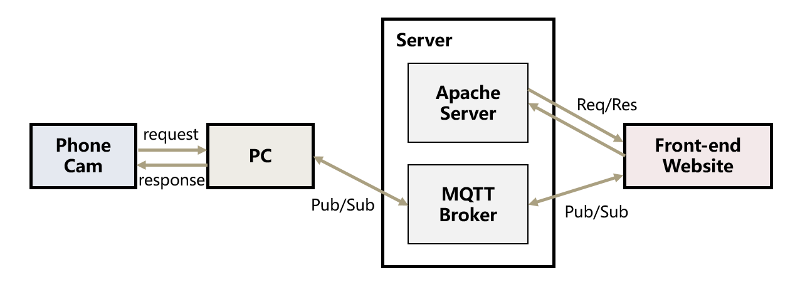

# <b>Drop A Ball From Phone To Website Project</b>

## <b>Building System Guide</b>
1.  Install mqtt broker server you like(ex: mosquitto)
2.  Build a apache server, but if you don't want to do so, just open dynamicWebsite.html with browser.
3.  install ip cam app in smartphone
4.  pip all installed tool used
5.  set ip of smartphone's and broker's ip in .py and .js file.

## <b>Instructions</b>
1.  open dynamicWebsite.html with browser
2.  click connect button to connect mqtt broker
3.  open ip cam app in phone
4.  run python code
5.  start to use hand catch and drop

## <b>Achievement</b>
### <b>From PC Server End</b>

### <b>From Phone End</b>

## Architecture of System

Deverlopers: Hong-Ji Lu, 莊嘉穎, 陳知昊
